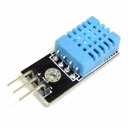
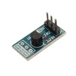
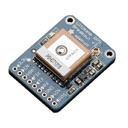
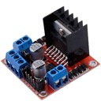
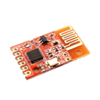
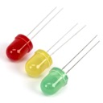
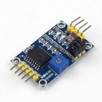
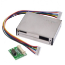
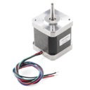

# rpi-devices 
[](https://app.travis-ci.com/shanghuiyang/rpi-devices)

rpi-devices implements drivers for various kinds of sensors or devices based on raspberry pi in pure golang.

## Usage
```go
package main

import (
	"time"

	"github.com/shanghuiyang/rpi-devices/dev"
)

const (
	pin = 26
)

func main() {
	led := dev.NewLedImp(pin)

	led.On()
	time.Sleep(3 * time.Second)
	led.Off()
}
```

## Currently Implemented Drivers

|Sensors|Image|Description|Example|App|
|-------|-----|-----|-------|---|
|ADS1015||Analog-to-digital converter|N/A|[joystick](/app/joystick)|
|Button||Button module|[example](/example/button/main.go)|[vedio-monitor](/app/vmonitor)|
|Buzzer||Buzzer module|N/A|[car](/app/car), [door-dog](/app/doordog)|
|Collision Detector||A switch for deteching collision|[example](/example/collision_detector/main.go)|[car](/app/car)|
|DHT11||Temperature & Humidity sensor|[example](/example/dht11/main.go)|[home-asst](/app/homeasst)|
|DS18B20||Temperature sensor|[example](/example/temperature/main.go)|[auto-fan](/app/autofan)|
|Encoder||Encoder sensor|[example](/example/encoder/main.go)|N/A|
|GPS||Location sensor|[example](/example/gps/main.go)|[gps-tracker](/app/gpstracker)|
|GY-25||Angle sensor|[example](/example/gy25/main.go)|[car](/app/car)|
|HC-SR04||Ultrasonic distance meter|[example](/example/hcsr04/main.go)|[auto-light](/app/autolight), [doordog](/app/doordog)|
|Humidity Detector||Soil humidity detector|[example](/example/humidity-detector/main.go)|N/A|
|Infrared||Infrared sensor|[example](/example/ir_detector/main.go)|N/A|
|Infrared Encoder/Decoder||Infrared encoder/decoder|[example](/example/ir_coder/main.go)|N/A|
|Joystick||XY Dual Axis Joystick|[example](/example/joystick/main.go)|[car](/app/car)|
|L298N||motor driver|N/A|[car](/app/car)|
|LC12S||2.4g wireless module|[example](/example/lc12s/main.go)|[car](/app/car)|
|LCD 1602A Display||lcd display module|[example](/example/lcddisplay/main.go)|[home-asst](/app/homeasst)
|Led||Led light|[example](/example/led/main.go)|[car](/app/car), [vedio-monitor](/app/vmonitor)|
|Led Display||led digital module|[example](/example/leddisplay/main.go)|[auto-air](/app/autoair)|
|MPU6050||6-axis motion sensor|[example](/example/mpu6050/main.go)|N/A|
|Oled||Oled display module|[example](/example/oled/main.go)|[home-asst](/app/homeasst)|
|PCF8591||Analog-to-digital converter|N/A|N/A|
|PMS7003||Air quality sensor|[example](/example/air/main.go)|[auto-air](/app/autoair)|
|Relay||Relay module|[example](/example/relay/main.go)|[auto-fan](/app/autofan)|
|RX480E-4||Wireless remote control|[example](/example/rx480e4/main.go)|[remote-light](/app/rlight)|
|SG90||Servo motor|[example](/example/sg90/main.go)|[auto-air](/app/autoair), [car](/app/car), [vedio-monitor](/app/vmonitor)|
|Step Motor||Step motor|[example](/example/stepmotor/main.go)|N/A|
|SW-420||Shaking sensor|[example](/example/sw420/main.go)|[auto-air-out](/app/autoairout)|
|US-100||ultrasonic distance meter|[example](/example/us100/main.go)|[car](/app/car)|
|Voice||Voice sensor|N/A|N/A|
|ZE08-CH2O||CH2O sensor|[example](/example/ch2o/main.go)|[ch2o-monitor](/app/ch2omonitor)|


## Compile & Deploy

It is very easy to cross-compile and deploy for golang. It is an example that compiles the binary for raspberry pi on MacOS.
```shell
$ CGO_ENABLED=0 GOOS=linux GOARCH=arm GOARM=6 go build -o led example/led/main.go
````

If you aren't sure the cpu info of your raspberry pi, check it out by,
```shell
$ lscpu
# those are the cpu info of my raspberry pi 2.
# ------------------------------------------------------------
# Architecture:        armv6l
# Byte Order:          Little Endian
# CPU(s):              1
# On-line CPU(s) list: 0
# Thread(s) per core:  1
# Core(s) per socket:  1
# Socket(s):           1
# Vendor ID:           ARM
# Model:               7
# Model name:          ARM1176
# Stepping:            r0p7
# CPU max MHz:         700.0000
# CPU min MHz:         700.0000
# BogoMIPS:            697.95
# Flags:               half thumb fastmult vfp edsp java tls
# ------------------------------------------------------------
```

And then, deploy the binary to your raspberry pi by,
```shell
$ scp led pi@192.168.31.57:/home/pi
```
`192.168.31.57` is the ip address of my raspberry pi, you need to replace it with yours.

ssh to you raspberry pi, and run the binary.
```shell
# from /home/pi
$ ssh pi@192.168.31.57
$ ./led

# or, run it in background
$ nohub ./led > test.log 2>&1 &
```

## App
Using the driver programs, I built several applications. The most complex app is the [smart car](/app/car), more than 10 sensers were used to build the car. I highlight few funny apps here, please go to [app](/app) for all apps I developed. You can learn how to use the drivers from my apps.
### [Self-Dirving Car](/app/car)
play the video on [youtube](https://www.youtube.com/watch?v=RNqe4byzXmw).


### [Video Monitor](/app/vmonitor)


### [Auto-Air](/app/autoair)


### [Auto-Light](/app/autolight)

