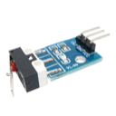
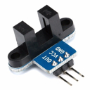
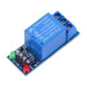
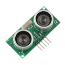
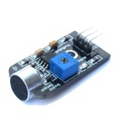
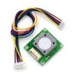

# rpi-devices 
[](https://travis-ci.org/shanghuiyang/rpi-devices)

rpi-devices let you drive the devices and sensors using a raspberry pi in pure golang.
The following devices & sensors had been implemented in the current version, and I will keep implementing new devices and sensors.


|Sensors|Image|Description|Example|App|
|-------|-----|-----|-------|---|
|Button||Button module|[example](/example/button/button.go)|[vedio-monitor](/app/vmonitor)|
|Buzzer||Buzzer module|N/A|[car](/app/car), [door-dog](/app/doordog)|
|Collision Switch||A switch for deteching collision|[example](/example/collisionswitch/collisionswitch.go)|[car](/app/car)|
|DHT11||Temperature & Humidity sensor|[example](/example/dht11/dht11.go)|[home-assit](/app/homeassit)|
|DS18B20||Temperature sensor|[example](/example/temperature/temperature.go)|[auto-fan](/app/autofan)|
|Encoder||Encoder sensor|[example](/example/encoder/encoder.go)|[car](/app/car)|
|GPS|)|location sensor|[example](/example/gps/gps.go)|[gps-tracker](/app/gpstracker)|
|HC-SR04||ultrasonic distance meter|[example](/example/hcsr04/hcsr04.go)|[auto-light](/app/autolight), [doordog](/app/doordog)|
|Infrared||Infrared sensor|[example](/example/infrared/infrared.go)|N/A|
|L298N||motor driver|N/A|[car](/app/car)|
|Led||Led light|[example](/example/led/led.go)|[car](/app/car), [vedio-monitor](/app/vmonitor)|
|Led Display||led digital module|[example](/example/leddisplay/leddisplay.go)|[auto-air](/app/autoair)|
|Oled||Oled display module|[example](/example/oled/oled.go)|[home-assit](/app/homeassit)|
|PMS7003||Air quality sensor|[example](/example/air/air.go)|[auto-air](/app/autoair)|
|Relay||Relay module|[example](/example/relay/relay.go)|[auto-fan](/app/autofan)|
|RX480E-4||Wireless remote control|[example](/example/rx480e4/rx480e4.go)|[remote-light](/app/rlight)|
|SG90||Servo motor|[example](/example/sg90/sg90.go)|[auto-air](/app/autoair), [car](/app/car), [vedio-monitor](/app/vmonitor)|
|Step Motor||Step motor|[example](/example/stepmotor/stepmotor.go)|N/A|
|SW-420||Shaking sensor|[example](/example/sw420/sw420.go)|[auto-air-out](/app/autoairout)|
|US-100||ultrasonic distance meter|[example](/example/us100/us100.go)|[car](/app/car)|
|Voice||Voice sensor|N/A|N/A|
|ZE08-CH2O||CH2O sensor|[example](/example/ch20/ch2o.go)|[ch2o-monitor](/app/ch2omonitor)|


## Compile & Deploy

It is very easy to cross-compile and deploy for golang. It is an example that compiles the binary for raspberry pi on MacOS.
```shell
$ CGO_ENABLED=0 GOOS=linux GOARCH=arm GOARM=6 go build -o app.pi main.go
````

If you aren't sure the cpu info of your raspberry pi, check it out by,
```shell
$ lscpu
# those are the cpu info of my raspberry pi 2.
# ------------------------------------------------------------
# Architecture:        armv6l
# Byte Order:          Little Endian
# CPU(s):              1
# On-line CPU(s) list: 0
# Thread(s) per core:  1
# Core(s) per socket:  1
# Socket(s):           1
# Vendor ID:           ARM
# Model:               7
# Model name:          ARM1176
# Stepping:            r0p7
# CPU max MHz:         700.0000
# CPU min MHz:         700.0000
# BogoMIPS:            697.95
# Flags:               half thumb fastmult vfp edsp java tls
# ------------------------------------------------------------
```

And then, deploy the binary to your raspberry pi by,
```shell
$ scp app.pi pi@192.168.31.57:/home/pi
```
`192.168.31.57` is the ip address of my raspberry pi, you need to replace it with yours.

ssh to you raspberry pi, and run the binary.
```shell
$ ssh pi@192.168.31.57
$ ./devices.pi

# or, run it in background
$ nohub ./devices.pi > devices.pi 2>&1 &
```

## App
### [Self-Dirving Car](/app/car)


### [Video Monitor](/app/vmonitor)


### [Auto-Air](/app/autoair)


### [Auto-Light](/app/autolight)


## [Auto-Fan](/app/autofan)

